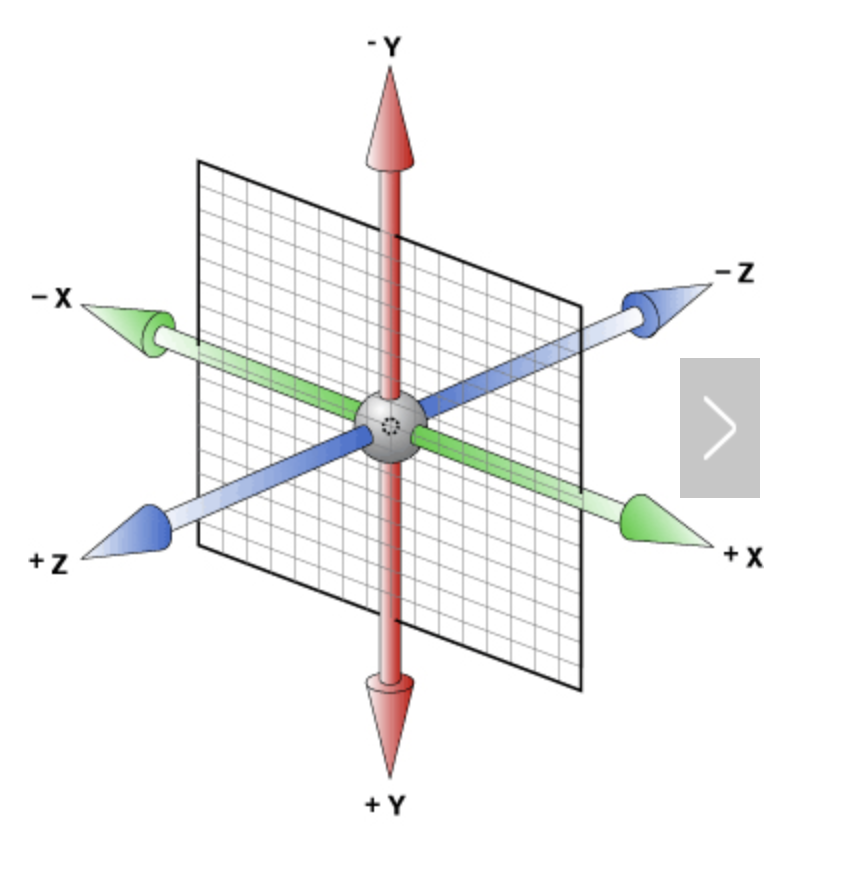
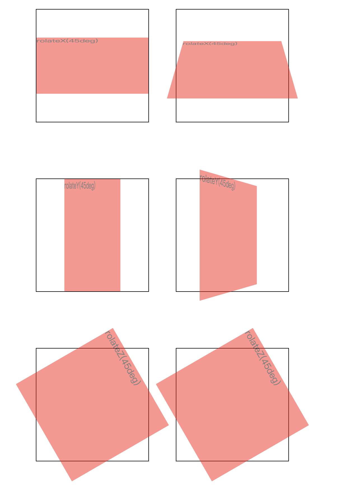

#css3动画属性
## transition 过渡
transition允许css属性值在一定时间内可以平滑地过渡。其主要包括四个属性值：
- transition-property 过渡效果的css属性名称
- transiton-duration 过渡时间
- transition-timing-function 过渡效果的速度曲线 可以取值

    取值| 描述
    :--- | :---
    linear| 平滑，相同的速度
    ease| 先慢后快再慢
    ease-in|以慢速开始
    ease-out|以慢速结束
    ease-in-out|以慢速开始和结束的过渡效果

- transition-delay 延迟时间

**这里需要注意一下几点**
> transition需要事件触发，不可以在网页加载时自动发生  
> transition是一次性的，不能重复发生，除非是一再触发
>

### 示例
```
<style>
    #box {
        width: 40px;
        height: 40px;
        background-color: #f00;
        transition: width 2s ease .5s; 
    }
    #box:hover {
        width: 100px;
    }
</style>
<div id="box"></div>
```

## animation 动画
animation动画，其可以不需要事件触发就可以进行，其属性如下：
- animation-name 需要绑定到选择器的keyframe名称
- animation-duration 动画持续时间
- animation-timing-function 动画速度曲线，以什么样的速度进行变化，与transition的animation-timing-function一样
- animation-delay 动画延迟时间
- animation-iteration-count 播放次数，其取值可以是数字，或者infinite(无限次播放)
- animation-direction 是否应该轮流反向播放动画，默认取值normal，也可以取值alternate(反响播放动画)
- animation-play-state 规定动画是否正在运行或暂停
- animation-fill-mode 固定动画时间之外状态
    值|描述
    :--|:--
    none|不改变默认行为
    forwards|保持最后一个属性值
    backwards|应用开始属性值
    both| 根据animation-direction轮流应用forwards和backwards规则。

### keyframe
@keyframes，控制动画的中间环节，其主要必须需要的三个值是：
值|描述
:--|:--
animation-name| 动画名称
keyframes-selector| 动画市场的百分比，0-100%
css-styles| css样式属性
### 示例
```
<style>
    .box {
        width: 50px;
        height: 50px;
        background-color: #f00;
        animation: change 2s ease 0.1s infinite;
    }
    @keyframes change {
        50% {
            width: 150px;
            height: 150px;
            opacity: 0.3;
        }
        100% {
            width: 50px;
            height: 50px;
            opacity: 1;
        }
    }
</style>
<div class="box"></div>
```

## transform 变形
主要包括旋转(rotate)、扭曲(skew)、缩放(scale)、移动(translate)和矩阵变形(matrix)。其中比较常用的三种是rotate、scale和translate。
### transform-origin 设置旋转元素的基点位置
**注意该属性必须和transform一起使用**  
transform-origin:x-axis y-axis z-axis。其默认值是50% 50% 0。  
x-axis和y-axis的取值可以是left、center、right、length和%。  
z-axis的取值只能是length
### 1. 2d转换
- translate(x,y) 平移  
- rotate(xdeg)沿着顺时针旋转，允许负值  
- scale(x,y)尺寸缩放  
- skew(x,y)根据给定的水平线和垂直线进行给定角度的翻转  
- matrix()把所有的2d转换方法结合在一起 

### 2. 3d转换
首先要弄清楚，在3d的方向怎么确定，哪个方向是x轴，哪个方向是y轴，哪个方向是z轴。这里可以通过下图看出。通过这个图，我们就可以确认rotateX、rotateY、rotateZ分别是按照哪个方向转换。

**结合3d转换的话，需要知道一个属性，perspective（视角）**
#### perspective
定义3d元素距视角的距离，其值是number|none。其视点是浏览器正前方，就是我们眼睛看着电脑所在的方位。
#### perspective-origin 设置基点的位置
perspective-origin: x-axis y-axis;

### 示例
```
    <style>
        .box {
            width: 200px;
            height: 200px;
            background-color: #f00;
            opacity: 0.5;
        }
        .aa:hover {
            transition: transform 1s ease;
            transform: rotateZ(180deg);
        }
        .bb:hover {
            transform: rotateY(180deg);
            transition: transform 1s ease;
        }
        .cc {
            transform: rotateX(60deg);
        }
        .dd {
            transform: rotateY(60deg);
        }
        .ee {
            transform: rotateZ(60deg);
        }
        .box-container {
            margin: 100px;
            width: 200px;
            height: 200px;
            border: 1px solid #000;
            perspective: 600px;
        }
    </style>
    <div class="box-container">
        <div class="cc box">rolateX(45deg)</div>
    </div>
    <div class="box-container">
        <div class="dd box">rolateY(45deg)</div>
    </div>
    <div class="box-container">
        <div class="ee box">rolateZ(45deg)</div>
    </div>
```
不加perspective: 600px;其效果图如下左图，加上perspective: 600px;其效果图如右图：

这里如果不加上perspective这个属性，你会发现图像还是平面的效果，但是加上这个属性给视点到浏览器一个视觉距离之后，会看到一个3d的效果。
## 3D效果
注意有一个属性。transform-style: preserve-3d的属性设置，默认值为flat，即“素描作品”。这个属性的设置旨在告诉子元素需要遵循怎样的空间体系规则。这个属性不能继承，因此只要有子元素需要设置空间体系规则，就得在父元素声明这个属性。


!(http://lyxuncle.github.io/pageturning/demo/demo.html)